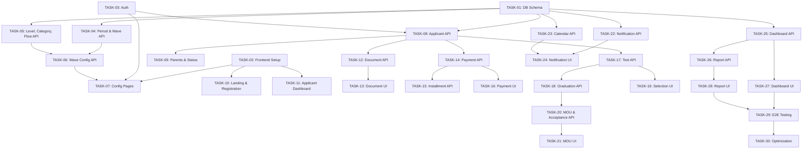

> ⚠️ **OBSOLETE — DO NOT USE**
>
> Dokumen versi **lama** untuk PPDB. Seluruh flow, model data, dan arsitektur sudah diganti (rebuild dari nol: Periode → Gelombang).
> **JANGAN dipakai.** Baca dokumentasi terbaru di `ppdb/README.md`, `ppdb/PRD.md`, `ppdb/FLOW.md`, `ppdb/ERD.md`, `ppdb/plan/PLAN.md`.

# 📋 Implementation Plan — Sistem PPDB Terintegrasi

## Document Information

| Item | Value |
|------|-------|
| Source | [PRD.md](file:///C:/ptdarrahman.sch.id/ppdb/PRD.md) + [ERD.md](file:///C:/ptdarrahman.sch.id/ppdb/ERD.md) |
| Status | Draft |
| Created | July 2026 |
| Tech Stack | Frontend: React + TypeScript + Vite + TailwindCSS / Backend: Hono (existing) + Python FastAPI (existing) |

---

## 1. Ringkasan Proyek

Sistem PPDB Terintegrasi adalah platform digital end-to-end untuk mengelola penerimaan peserta didik baru di pesantren/sekolah. Sistem ini mencakup:
- Multi-periode & multi-gelombang pendaftaran
- Multi-jenjang pendidikan & kategori pendaftaran
- Flow seleksi dinamis (configurable)
- Pembayaran terintegrasi (payment gateway + manual)
- Manajemen dokumen, MOU, surat penerimaan
- Dashboard & reporting per role
- Notification center (WhatsApp + Email)
- Audit trail lengkap

### Current State
- Frontend: Boilerplate Vite + React (belum ada implementasi PPDB)
- Backend: Hono (TypeScript) + FastAPI (Python) — sudah ada auth, roles, users, students, SPP, company profile
- Database: PostgreSQL via Drizzle ORM (Hono) + SQLAlchemy (FastAPI)

---

## 2. Arsitektur Tingkat Tinggi

```
┌─────────────────────────────────────────────────────────┐
│                    PPDB Frontend                        │
│              React + TypeScript + Vite                  │
│                                                         │
│  ┌──────────┐ ┌──────────┐ ┌──────────┐ ┌──────────┐  │
│  │ Public   │ │ Applicant│ │ Admin    │ │ Finance  │  │
│  │ Landing  │ │ Portal   │ │ Dashboard│ │ Dashboard│  │
│  └──────────┘ └──────────┘ └──────────┘ └──────────┘  │
└──────────────────────┬──────────────────────────────────┘
                       │ REST API
┌──────────────────────┴──────────────────────────────────┐
│                  Backend API (Hono)                      │
│                                                         │
│  ┌────────┐ ┌────────┐ ┌────────┐ ┌────────┐          │
│  │ Auth   │ │ PPDB   │ │Payment │ │Notif   │          │
│  │Module  │ │ Config │ │Module  │ │Module  │          │
│  └────────┘ └────────┘ └────────┘ └────────┘          │
│  ┌────────┐ ┌────────┐ ┌────────┐ ┌────────┐          │
│  │Applicant│ │Doc     │ │Selection│ │Report  │          │
│  │Module  │ │Module  │ │Module  │ │Module  │          │
│  └────────┘ └────────┘ └────────┘ └────────┘          │
└──────────────────────┬──────────────────────────────────┘
                       │
              ┌────────┴────────┐
              │   PostgreSQL    │
              │   (37 tables)   │
              └─────────────────┘
```

---

## 3. Phase Breakdown

### Phase 1 — Foundation & Core Setup
> Bangun pondasi: database schema, auth integration, routing, layout

| Task | Deskripsi | Estimasi |
|------|-----------|----------|
| [TASK-01](file:///C:/ptdarrahman.sch.id/ppdb/plan/task/TASK-01.md) | Database Schema & Migrations | 3-4 hari |
| [TASK-02](file:///C:/ptdarrahman.sch.id/ppdb/plan/task/TASK-02.md) | Frontend Project Setup (Router, Layout, Auth) | 2-3 hari |
| [TASK-03](file:///C:/ptdarrahman.sch.id/ppdb/plan/task/TASK-03.md) | Auth Integration (Login, Register, Token) | 2-3 hari |

### Phase 2 — PPDB Configuration Module (Admin)
> Superadmin bisa konfigurasi PPDB

| Task | Deskripsi | Estimasi |
|------|-----------|----------|
| [TASK-04](file:///C:/ptdarrahman.sch.id/ppdb/plan/task/TASK-04.md) | API: PPDB Period & Wave CRUD | 2-3 hari |
| [TASK-05](file:///C:/ptdarrahman.sch.id/ppdb/plan/task/TASK-05.md) | API: Education Level, Category, Selection Flow | 2-3 hari |
| [TASK-06](file:///C:/ptdarrahman.sch.id/ppdb/plan/task/TASK-06.md) | API: Wave Configuration (Level + Category + Flow mapping) | 1-2 hari |
| [TASK-07](file:///C:/ptdarrahman.sch.id/ppdb/plan/task/TASK-07.md) | Frontend: PPDB Configuration Pages | 3-4 hari |

### Phase 3 — Applicant Registration & Profile
> Calon murid mendaftar, isi data, lihat status

| Task | Deskripsi | Estimasi |
|------|-----------|----------|
| [TASK-08](file:///C:/ptdarrahman.sch.id/ppdb/plan/task/TASK-08.md) | API: Applicant Registration & Profile | 2-3 hari |
| [TASK-09](file:///C:/ptdarrahman.sch.id/ppdb/plan/task/TASK-09.md) | API: Applicant Parents & Status History | 1-2 hari |
| [TASK-10](file:///C:/ptdarrahman.sch.id/ppdb/plan/task/TASK-10.md) | Frontend: Public Landing & Registration Form | 3-4 hari |
| [TASK-11](file:///C:/ptdarrahman.sch.id/ppdb/plan/task/TASK-11.md) | Frontend: Applicant Dashboard & Profile | 2-3 hari |

### Phase 4 — Document Management
> Upload, review, approve/reject dokumen

| Task | Deskripsi | Estimasi |
|------|-----------|----------|
| [TASK-12](file:///C:/ptdarrahman.sch.id/ppdb/plan/task/TASK-12.md) | API: Document Requirements & Applicant Documents | 2-3 hari |
| [TASK-13](file:///C:/ptdarrahman.sch.id/ppdb/plan/task/TASK-13.md) | Frontend: Document Upload & Review | 2-3 hari |

### Phase 5 — Payment Management
> Invoice, payment gateway, manual payment, cicilan, diskon

| Task | Deskripsi | Estimasi |
|------|-----------|----------|
| [TASK-14](file:///C:/ptdarrahman.sch.id/ppdb/plan/task/TASK-14.md) | API: Payment Stages, Invoices, Transactions | 3-4 hari |
| [TASK-15](file:///C:/ptdarrahman.sch.id/ppdb/plan/task/TASK-15.md) | API: Installment Plans & Discounts | 2-3 hari |
| [TASK-16](file:///C:/ptdarrahman.sch.id/ppdb/plan/task/TASK-16.md) | Frontend: Payment & Invoice Pages | 3-4 hari |

### Phase 6 — Selection & Testing
> Tes dinamis, penjadwalan, penilaian, kelulusan

| Task | Deskripsi | Estimasi |
|------|-----------|----------|
| [TASK-17](file:///C:/ptdarrahman.sch.id/ppdb/plan/task/TASK-17.md) | API: Test Types, Parameters, Sessions | 2-3 hari |
| [TASK-18](file:///C:/ptdarrahman.sch.id/ppdb/plan/task/TASK-18.md) | API: Test Results, Scores, Graduation Rules | 2-3 hari |
| [TASK-19](file:///C:/ptdarrahman.sch.id/ppdb/plan/task/TASK-19.md) | Frontend: Selection & Testing Pages | 3-4 hari |

### Phase 7 — MOU & Acceptance
> MOU, surat penerimaan, registrasi ulang, MPLS

| Task | Deskripsi | Estimasi |
|------|-----------|----------|
| [TASK-20](file:///C:/ptdarrahman.sch.id/ppdb/plan/task/TASK-20.md) | API: MOU, Acceptance Letters, Re-registration, MPLS | 2-3 hari |
| [TASK-21](file:///C:/ptdarrahman.sch.id/ppdb/plan/task/TASK-21.md) | Frontend: MOU, Acceptance & Re-registration Pages | 3-4 hari |

### Phase 8 — Notifications & Calendar
> WhatsApp, Email, Reminder, Kalender Akademik

| Task | Deskripsi | Estimasi |
|------|-----------|----------|
| [TASK-22](file:///C:/ptdarrahman.sch.id/ppdb/plan/task/TASK-22.md) | API: Notification Center & Templates | 2-3 hari |
| [TASK-23](file:///C:/ptdarrahman.sch.id/ppdb/plan/task/TASK-23.md) | API: Academic Calendar | 1 hari |
| [TASK-24](file:///C:/ptdarrahman.sch.id/ppdb/plan/task/TASK-24.md) | Frontend: Notification & Calendar Pages | 2-3 hari |

### Phase 9 — Dashboard & Reporting
> Dashboard per role, export, audit trail

| Task | Deskripsi | Estimasi |
|------|-----------|----------|
| [TASK-25](file:///C:/ptdarrahman.sch.id/ppdb/plan/task/TASK-25.md) | API: Dashboard Statistics & Audit Logs | 2-3 hari |
| [TASK-26](file:///C:/ptdarrahman.sch.id/ppdb/plan/task/TASK-26.md) | API: Reporting (PDF, Excel Export) | 2-3 hari |
| [TASK-27](file:///C:/ptdarrahman.sch.id/ppdb/plan/task/TASK-27.md) | Frontend: Dashboard per Role | 3-4 hari |
| [TASK-28](file:///C:/ptdarrahman.sch.id/ppdb/plan/task/TASK-28.md) | Frontend: Reporting & Export Pages | 2-3 hari |

### Phase 10 — Integration Testing & Polish
> End-to-end testing, bug fixing, optimasi

| Task | Deskripsi | Estimasi |
|------|-----------|----------|
| [TASK-29](file:///C:/ptdarrahman.sch.id/ppdb/plan/task/TASK-29.md) | End-to-End Flow Testing | 3-4 hari |
| [TASK-30](file:///C:/ptdarrahman.sch.id/ppdb/plan/task/TASK-30.md) | Performance Optimization & Security Hardening | 2-3 hari |

---

## 4. Database Tables Mapping (ERD → Modules)

| Module | Tables |
|--------|--------|
| Auth & Users | `users`, `roles`, `user_roles`, `refresh_tokens` |
| PPDB Config | `ppdb_periods`, `ppdb_waves`, `education_levels`, `registration_categories`, `selection_flows`, `selection_flow_steps`, `wave_configurations` |
| Applicant | `applicants`, `applicant_profiles`, `applicant_parents`, `applicant_status_histories` |
| Documents | `document_requirements`, `applicant_documents` |
| Selection | `test_types`, `test_parameters`, `test_sessions`, `applicant_test_sessions`, `applicant_test_results`, `applicant_test_scores`, `graduation_rules`, `applicant_graduations` |
| Payment | `payment_stages`, `invoices`, `payment_transactions`, `installment_plans`, `installment_schedules`, `discounts`, `applicant_discounts` |
| MOU | `mou_templates`, `applicant_mous` |
| Acceptance | `acceptance_letters`, `re_registrations` |
| MPLS | `mpls_schedules`, `applicant_mpls` |
| Calendar | `academic_calendars` |
| Notifications | `notifications`, `notification_templates` |
| Storage | `file_uploads` |
| Audit | `audit_logs` |
| Dashboard | `dashboard_statistics` |

**Total: 37 tables**

---

## 5. User Roles & Access Matrix

| Feature | Calon Murid | Orang Tua | Admin Seleksi | Penguji | Finance | Superadmin |
|---------|:-----------:|:---------:|:-------------:|:-------:|:-------:|:----------:|
| Registrasi | ✅ | — | — | — | — | — |
| Profile | ✅ | 👁 | 👁 | — | — | 👁 |
| Upload Dokumen | ✅ | — | — | — | — | — |
| Review Dokumen | — | — | ✅ | — | — | ✅ |
| Jadwal Tes | 👁 | 👁 | ✅ | 👁 | — | ✅ |
| Input Nilai | — | — | — | ✅ | — | ✅ |
| Kelulusan | 👁 | 👁 | ✅ | — | — | ✅ |
| Pembayaran | ✅ | ✅ | — | — | ✅ | ✅ |
| Invoice | 👁 | 👁 | — | — | ✅ | ✅ |
| MOU | ✅ | — | ✅ | — | — | ✅ |
| Dashboard | — | — | ✅ | ✅ | ✅ | ✅ |
| Config PPDB | — | — | — | — | — | ✅ |
| Audit Trail | — | — | — | — | — | ✅ |

> ✅ = Full Access, 👁 = Read Only, — = No Access

---

## 6. Dependency Graph



---

## 7. Estimasi Total

| Phase | Estimasi |
|-------|----------|
| Phase 1 — Foundation | 7-10 hari |
| Phase 2 — PPDB Config | 8-12 hari |
| Phase 3 — Applicant | 8-12 hari |
| Phase 4 — Documents | 4-6 hari |
| Phase 5 — Payment | 8-11 hari |
| Phase 6 — Selection | 7-10 hari |
| Phase 7 — MOU & Acceptance | 5-7 hari |
| Phase 8 — Notifications | 5-7 hari |
| Phase 9 — Dashboard & Reports | 9-13 hari |
| Phase 10 — Testing & Polish | 5-7 hari |
| **TOTAL** | **~66-95 hari kerja** |

> ⚠️ Estimasi berdasarkan 1 developer full-time. Dengan tim, timeline bisa dipercepat signifikan karena banyak task bisa dikerjakan paralel.

---

## 8. Task List Summary

| ID | Task | Phase | Dependencies | Priority |
|----|------|-------|--------------|----------|
| TASK-01 | Database Schema & Migrations | 1 | — | 🔴 Critical |
| TASK-02 | Frontend Project Setup | 1 | — | 🔴 Critical |
| TASK-03 | Auth Integration | 1 | TASK-01 | 🔴 Critical |
| TASK-04 | API: Period & Wave CRUD | 2 | TASK-01 | 🔴 Critical |
| TASK-05 | API: Level, Category, Flow | 2 | TASK-01 | 🔴 Critical |
| TASK-06 | API: Wave Configuration | 2 | TASK-04, TASK-05 | 🟡 High |
| TASK-07 | Frontend: Config Pages | 2 | TASK-02, TASK-06 | 🟡 High |
| TASK-08 | API: Applicant Registration | 3 | TASK-01, TASK-03 | 🔴 Critical |
| TASK-09 | API: Parents & Status | 3 | TASK-08 | 🟡 High |
| TASK-10 | Frontend: Landing & Registration | 3 | TASK-02, TASK-08 | 🔴 Critical |
| TASK-11 | Frontend: Applicant Dashboard | 3 | TASK-02, TASK-08 | 🟡 High |
| TASK-12 | API: Document Management | 4 | TASK-08 | 🟡 High |
| TASK-13 | Frontend: Document Upload & Review | 4 | TASK-12 | 🟡 High |
| TASK-14 | API: Payment Stages & Invoice | 5 | TASK-08 | 🔴 Critical |
| TASK-15 | API: Installment & Discounts | 5 | TASK-14 | 🟡 High |
| TASK-16 | Frontend: Payment Pages | 5 | TASK-14 | 🟡 High |
| TASK-17 | API: Test Types & Sessions | 6 | TASK-08 | 🟡 High |
| TASK-18 | API: Results & Graduation | 6 | TASK-17 | 🟡 High |
| TASK-19 | Frontend: Selection Pages | 6 | TASK-17 | 🟡 High |
| TASK-20 | API: MOU & Acceptance | 7 | TASK-18 | 🟢 Medium |
| TASK-21 | Frontend: MOU & Acceptance | 7 | TASK-20 | 🟢 Medium |
| TASK-22 | API: Notifications | 8 | TASK-01 | 🟢 Medium |
| TASK-23 | API: Academic Calendar | 8 | TASK-01 | 🟢 Medium |
| TASK-24 | Frontend: Notif & Calendar | 8 | TASK-22, TASK-23 | 🟢 Medium |
| TASK-25 | API: Dashboard & Audit | 9 | TASK-01 | 🟡 High |
| TASK-26 | API: Reporting | 9 | TASK-25 | 🟢 Medium |
| TASK-27 | Frontend: Dashboard | 9 | TASK-25 | 🟡 High |
| TASK-28 | Frontend: Reporting | 9 | TASK-26 | 🟢 Medium |
| TASK-29 | E2E Testing | 10 | All | 🔴 Critical |
| TASK-30 | Optimization & Security | 10 | TASK-29 | 🟡 High |

